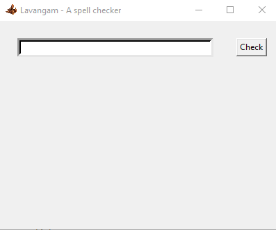
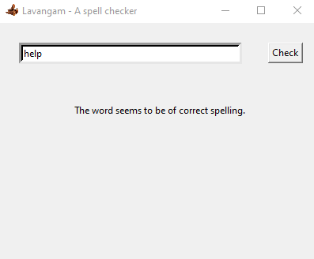
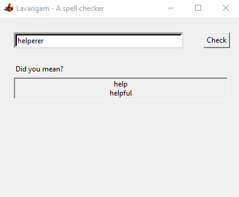

<h1>This is Lavangam!</h1> 
<ul>
<li>
<b>Lavangam</b> is a gui based spellchecker written in Python.

<li>
It uses a Trie internally to store/search for strings.

<li>
GUI is built using Python's Tkinter library.

</ul>
<h2>Usage:</h2>
<ul>
<li>
To use the application run the script named main.py

</ul>
 
<h2>Screenshot(s):</h2>
<ul>
<li>
The following is the screenshot of the application when run.

  
<li>
The following is the screenshot of the application when checked for a correctly spelt word.

  
<li>
The following is the screenshot of the application when checked for an incorrectly spelt word.

</ul>

<b>If you are aware of ways to improve the project, please write to rcreddyn@icloud.com </b>
